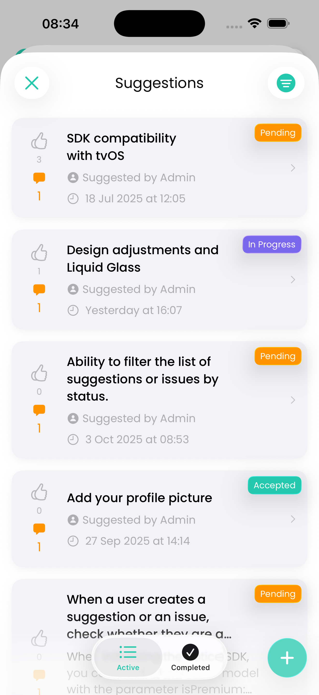
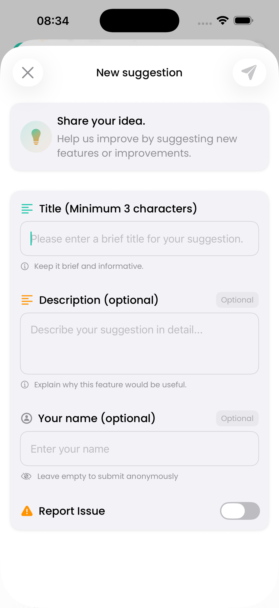
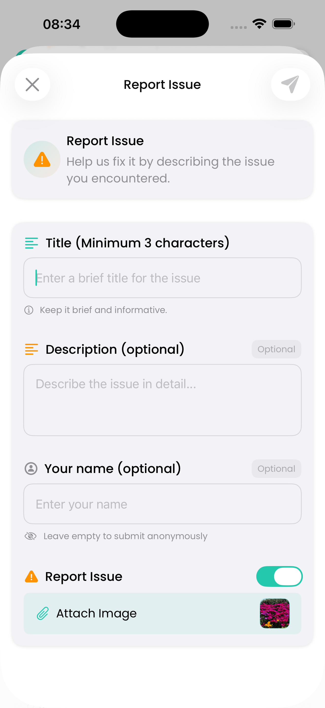
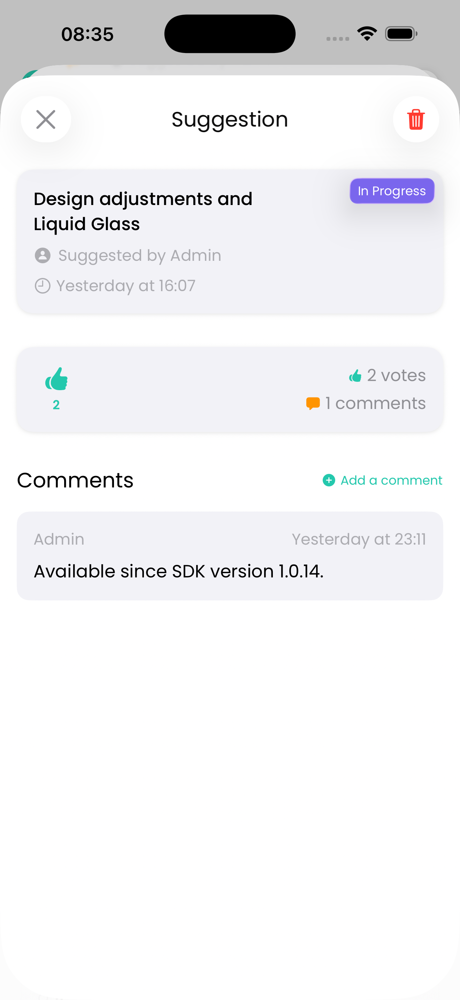

# Votice SDK

|  | 🗳️ A lightweight native Swift SDK to collect suggestions, feedback and votes directly within your iOS, iPadOS, macOS and tvOS app. |
|:---:|:---|

[](https://swift.org/)
[](#)
[](https://swift.org/package-manager/)
[](LICENSE)

Votice is a native Swift SDK that allows you to integrate user feedback, suggestion boards, issues, and voting mechanisms in your app with a clean UI and a simple setup. It connects to a custom backend using HMAC authentication and does not require Firebase or other configurations.

<p align="leading">
  
  
  
  
  
</p>

## 📱 Management App

The Votice management app for handling suggestions or issues and apps is available for download on the App Store:

[](https://apps.apple.com/us/app/id6673904950)

**Available for:** iOS, iPadOS and macOS.

---

## ✅ Requirements

- iOS 17+ / iPadOS 17+ / macOS 14+ / tvOS 17+
- Swift 5.0+
- SwiftUI-based project
- Votice backend properly configured (API key + secret)

## 🛠 Installation

Add this line to your `Package.swift` dependencies:

```swift
.package(url: "https://github.com/artcc/votice-sdk", from: "1.0.16"),
```

Or via Xcode:

1. Open your project.
2. Go to **File > Add Packages...**
3. Enter the URL of the Votice repo: https://github.com/artcc/votice-sdk
4. Choose the latest version.

## 📦 Package Info

```swift
// swift-tools-version:5.9
let package = Package(
    name: "Votice",
    platforms: [
        .iOS(.v17),
        .macOS(.v14),
        .tvOS(.v17)
    ],
    products: [
        .library(
            name: "VoticeSDK",
            targets: ["VoticeSDK"]
        )
    ],
    targets: [
        .target(
            name: "VoticeSDK",
            path: "Sources/Votice"
        ),
        .testTarget(
            name: "VoticeTests",
            dependencies: ["VoticeSDK"],
            path: "Tests/VoticeTests"
        )
    ]
)
```

## 🚀 Getting Started

### 1. Configure the SDK (Mandatory)

Before using any Votice component, configure it with your app credentials:

```swift
import VoticeSDK

try Votice.configure(
    apiKey: "your-api-key",
    apiSecret: "your-api-secret",
    appId: "your-app-id"
)
```

You can reset or check configuration status:

```swift
Votice.reset()

let configured = Votice.isConfigured
```

### 2. Show the Feedback UI (Mandatory) with basic configuration

You can embed the main interface as a SwiftUI view:

```swift
Votice.feedbackView()
```

Or present it as a modal sheet:

```swift
Votice.feedbackSheet(isPresented: $isShowingFeedback)
```

Or use a NavigationLink:

```swift
NavigationLink {
  Votice.feedbackNavigationView())
} label: {
  Text("Navigate to Feedback")
}
```

### 3. Customize Appearance (Optional)

Use the default system-adaptive theme:

```swift
let theme = Votice.systemTheme()
```

Or create your own theme:

```swift
let theme = Votice.createTheme(
    primaryColor: .blue,
    backgroundColor: .white,
    surfaceColor: .gray.opacity(0.1)
)
```

Advanced configuration is also available:

```swift
let customTheme = Votice.createAdvancedTheme(
    primaryColor: .purple,
    accentColor: .pink,
    backgroundColor: Color(.systemBackground),
    surfaceColor: Color(.secondarySystemBackground),
    destructiveColor: .red,
    successColor: .mint,
    warningColor: .orange)    
```

Then pass it into the view:

```swift
Votice.feedbackView(theme: theme)
```

### 4. Localize Texts (Optional)

You can provide custom localized texts by conforming to `VoticeTextsProtocol`:

```swift
Votice.setTexts(VoticeTexts())
```

Example:

```swift
struct VoticeTexts: VoticeTextsProtocol {
    let cancel = String(localized: "Cancel")
    let error = String(localized: "Error")
    let ok = String(localized: "Ok")
    let submit = String(localized: "Submit")
    let optional = String(localized: "Optional")
    let success = String(localized: "Success")
    let warning = String(localized: "Warning")
    let info = String(localized: "Information")
    let genericError = String(localized: "Something went wrong. Please try again.")
    let anonymous = String(localized: "Anonymous")
    let loadingSuggestions = String(localized: "Loading suggestions...")
    let noSuggestionsYet = String(localized: "No suggestions yet.")
    let beFirstToSuggest = String(localized: "Be the first to suggest something!")...
}
```

To reset to the default English:

```swift
Votice.resetTextsToDefault()
```

Check this URL to learn how to localize your app https://gist.github.com/ArtCC/10a0eff42f1f62c305b28c15883b9b9f

### 5. Using Custom Fonts (Optional)

You can customize all SDK interface fonts using your own fonts included in your project. This allows you to maintain visual consistency with your app's identity.

#### 1. Add your fonts to the project

1. Drag the font files (.ttf, .otf) into your Xcode project.
2. Make sure to add them in the "Copy Bundle Resources" section of your target.
3. Add the font names in the `Fonts provided by application` field in your Info.plist.

#### 2. Configure fonts in Votice

Create a font configuration and apply it to the SDK before displaying any Votice view:

```swift
let poppinsConfig = VoticeFontConfiguration(
    fontFamily: "Poppins",
    weights: [
        .regular: "Poppins-Regular",
        .medium: "Poppins-Medium",
        .semiBold: "Poppins-SemiBold",
        .bold: "Poppins-Bold"
    ]
)
Votice.setFonts(poppinsConfig)
```

- `fontFamily`: Name of the font family (must match the name registered in the system).
- `weights`: Dictionary with the exact names of each font weight variant.

#### 3. Reset to the system font

If you want to revert to the default iOS font:

```swift
Votice.resetFontsToSystem()
```

#### 4. Themes with custom fonts

You can create a theme that respects the custom font:

```swift
let theme = Votice.createThemeWithCurrentFonts(primaryColor: .blue)
```

Or use the system theme with the custom font:

```swift
let theme = Votice.systemThemeWithCurrentFonts()
```

Then pass it to the feedback view:

```swift
Votice.feedbackView(theme: theme)
```

> ℹ️ If you do not configure custom fonts, the SDK will use the default system fonts.

### 6. Comment on suggestions or issues (Optional)

You can allow users to comment on suggestions or issues by enabling the comments feature (Default is enabled):

```swift
Votice.setCommentIsEnabled(enabled: Bool)
```

### 7. User is premium (Optional)

If you want to mark the current user as a premium user (Default is false), you can do so with:

```swift
Votice.setUserIsPremium(isPremium: Bool)
```

### 8. Debug Logging (Optional)

By default, Votice SDK runs silently to avoid cluttering your development console. If you need to troubleshoot SDK issues or see internal operations, you can enable debug logging (Default is disabled):

Enable debug logging (useful for troubleshooting):
```swift
Votice.setDebugLogging(enabled: true)
```

Check current logging status:
```swift
let isLoggingEnabled = Votice.isDebugLoggingEnabled
```

Disable when no longer needed:
```swift
Votice.setDebugLogging(enabled: false)
```

**When to use debug logging:**
- Troubleshooting network requests to your backend
- Verifying SDK configuration
- Understanding internal SDK behavior
- During development/testing phases

**Note:** Debug logging is automatically disabled in production builds and should only be enabled when specifically needed for debugging purposes.

### 8. Show completed suggestions or issues in a separate tab (Optional)

You can choose to display suggestions or issues with status `completed` in their own tab. When enabled:

- A segmented control appears with two tabs: "Active" and "Completed".
- Completed suggestions or issues are removed from the main list.
- The "Completed" filter disappears from the filter menu (no longer needed).
- Completed suggestions or issues are only visible in the dedicated tab.
- If you don't enable it, the behavior remains the same as before.

Enable:
```swift
Votice.setShowCompletedSeparately(enabled: true)
```
Disable (returns to original behavior):
```swift
Votice.setShowCompletedSeparately(enabled: false)
```

### 9. Configure visible suggestion or issue statuses (Optional)

By default, all optional statuses (`accepted`, `blocked`, `rejected`) are visible along with the mandatory ones. You can choose which optional statuses to show in both the list and the filter menu.

Mandatory statuses (always shown):
- `completed` (or in its separate tab if you enabled section 8)
- `in-progress`
- `pending`

Optional statuses (individually hideable):
- `accepted`
- `blocked`
- `rejected`

Configure which optional statuses are visible:
```swift
// Example: show accepted & rejected, hide blocked
Votice.setVisibleOptionalStatuses(accepted: true, blocked: false, rejected: true)
```

Behavior:
- Hidden optional statuses are removed from the filter menu and never displayed in the list.
- If a previously selected (persisted) filter becomes hidden, it is automatically cleared.
- Works together with the "completed separately" mode (section 8). If that mode is active, `completed` will still not appear in filters, regardless of this configuration.
- Defaults: all three optional statuses visible (equivalent to `true, true, true`).

Use cases:
- Simplify the board for early product phases (e.g. only pending + in-progress + completed)
- Gradually introduce refinement states later (enable accepted / blocked / rejected)

> Note: Calling this method multiple times replaces the previous configuration entirely.

### 10. Enable Liquid Glass design (Optional)

You can opt-in to use **Liquid Glass**, Apple's modern design material that combines dynamic blur with light reflection effects, creating a fluid and immersive glass-like interface. When enabled, UI components like dropdowns, cards, and sheets will adopt this new visual style (Default is enabled).

Enable Liquid Glass:
```swift
Votice.setLiquidGlassEnabled(true)
```

Disable (returns to the classic design):
```swift
Votice.setLiquidGlassEnabled(false)
```

**Platform requirements:**
- iOS 26+ / iPadOS 26+ / macOS 26+ (Tahoe) / tvOS 26+
- On older OS versions, the SDK will automatically fall back to the classic design even if enabled

**Benefits of Liquid Glass:**
- Modern, fluid glass-like visual design
- Dynamic blur that adapts to content behind
- Light and color reflection from surrounding elements
- Interactive effects that respond to touch and pointer interactions

**Default behavior:**
- Disabled by default for maximum compatibility
- Developers must explicitly opt-in to use Liquid Glass
- Works seamlessly with custom themes

> Note: Liquid Glass is a cutting-edge design feature introduced in Apple's latest OS versions. Test thoroughly with your app's design system before shipping to production.

---

## 🔧 Advanced: Using Use Cases Programmatically (Optional)

If you need to interact with Votice functionality without using the built-in UI components, you can access the use cases directly. This is useful for building custom interfaces or integrating Votice into your own workflows.

### Overview

Votice SDK exposes two main use cases:
- **SuggestionUseCase**: Manage suggestions, issues, votes, and images
- **CommentUseCase**: Manage comments on suggestions or issues

### Getting Use Case Instances

```swift
import VoticeSDK

// Get use case instances
let suggestionUseCase = Votice.getSuggestionUseCase()
let commentUseCase = Votice.getCommentUseCase()
```

### SuggestionUseCase

#### Fetch Suggestions or issues

Retrieve paginated suggestions or issues from your app:

```swift
let pagination = PaginationRequest(
    startAfter: nil, // For first page
    pageLimit: 20    // Number of items per page
)

Task {
    do {
        let response = try await suggestionUseCase.fetchSuggestions(pagination: pagination)
        
        print("Total suggestions: \(response.count)")
        for suggestion in response.suggestions {
            print("- \(suggestion.title ?? ""): \(suggestion.voteCount ?? 0) votes")
        }
        
        // For next page, use the token
        if let nextPage = response.nextPageToken {
            let nextPagination = PaginationRequest(
                startAfter: StartAfterRequest(
                    voteCount: nextPage.voteCount,
                    createdAt: nextPage.createdAt
                ),
                pageLimit: 20
            )
            // Fetch next page...
        }
    } catch {
        print("Error fetching suggestions: \(error)")
    }
}
```

#### Create a Suggestion or issue

Create a new suggestion or issue:

```swift
let request = CreateSuggestionRequest(
    title: "Add dark mode",
    description: "It would be great to have a dark theme option",
    nickname: "John Doe", // Optional: user's display name
    userIsPremium: true,  // Whether user has premium
    issue: false,         // true for issues, false for suggestions
    urlImage: nil         // Optional: image URL (use uploadImage first)
)

Task {
    do {
        let response = try await suggestionUseCase.createSuggestion(request: request)
        print("Suggestion created: \(response.suggestion.id)")
    } catch {
        print("Error creating suggestion: \(error)")
    }
}
```

#### Upload an Image

Upload an image to attach to a suggestion or issue:

```swift
#if canImport(UIKit)
import UIKit

// Convert UIImage to base64
guard let image = UIImage(named: "screenshot"),
      let imageData = image.jpegData(compressionQuality: 0.8) else {
    return
}

let base64String = imageData.base64EncodedString()

let request = UploadImageRequest(
    imageData: base64String,
    fileName: "screenshot.jpg",
    mimeType: "image/jpeg"
)

Task {
    do {
        let response = try await suggestionUseCase.uploadImage(request: request)
        // Use response.imageUrl in CreateSuggestionRequest
        print("Image uploaded: \(response.imageUrl)")
    } catch {
        print("Error uploading image: \(error)")
    }
}
#endif
```

#### Vote on a Suggestion or Issue

Upvote or downvote a suggestion or issue:

```swift
Task {
    do {
        // Upvote
        let response = try await suggestionUseCase.vote(
            suggestionId: "suggestion-id-here",
            voteType: .upvote
        )
        print("Vote registered: \(response.message)")
        
        // To remove vote (downvote)
        let removeResponse = try await suggestionUseCase.vote(
            suggestionId: "suggestion-id-here",
            voteType: .downvote
        )
    } catch {
        print("Error voting: \(error)")
    }
}
```

#### Check Vote Status

Check if the current device has already voted:

```swift
Task {
    do {
        let status = try await suggestionUseCase.fetchVoteStatus(
            suggestionId: "suggestion-id-here"
        )
        print("Has voted: \(status.hasVoted)")
        print("Total votes: \(status.voteCount)")
    } catch {
        print("Error fetching vote status: \(error)")
    }
}
```

#### Delete a Suggestion or Issue

Delete a suggestion or issue created by the current device:

```swift
Task {
    do {
        let response = try await suggestionUseCase.deleteSuggestion(
            suggestionId: "suggestion-id-here"
        )
        print("Suggestion deleted: \(response.message)")
    } catch {
        print("Error deleting suggestion: \(error)")
    }
}
```

#### Filter Management

Save and retrieve filter preferences locally:

```swift
// Save filter
try suggestionUseCase.setFilterApplied(.inProgress)

// Get current filter
let currentFilter = try suggestionUseCase.fetchFilterApplied()
print("Current filter: \(currentFilter?.rawValue ?? "none")")

// Clear filter
try suggestionUseCase.clearFilterApplied()
```

### CommentUseCase

#### Fetch Comments

Retrieve comments for a suggestion or issue:

```swift
let pagination = PaginationRequest(
    startAfter: nil,  // For first page
    pageLimit: 50
)

Task {
    do {
        let response = try await commentUseCase.fetchComments(
            suggestionId: "suggestion-id-here",
            pagination: pagination
        )
        
        print("Total comments: \(response.comments.count)")
        for comment in response.comments {
            print("- \(comment.displayName): \(comment.text)")
        }
    } catch {
        print("Error fetching comments: \(error)")
    }
}
```

#### Create a Comment

Add a comment to a suggestion or issue:

```swift
Task {
    do {
        let response = try await commentUseCase.createComment(
            suggestionId: "suggestion-id-here",
            text: "Great idea! I'd love to see this feature.",
            nickname: "Jane Doe"  // Optional: user's display name
        )
        print("Comment created: \(response.comment.id)")
    } catch {
        print("Error creating comment: \(error)")
    }
}
```

#### Delete a Comment

Delete a comment created by the current device:

```swift
Task {
    do {
        try await commentUseCase.deleteComment(commentId: "comment-id-here")
        print("Comment deleted successfully")
    } catch {
        print("Error deleting comment: \(error)")
    }
}
```

### Public Models Reference

#### Key Entities

```swift
// Suggestion entity (used for both suggestions and issues)
public struct SuggestionEntity {
    public let id: String
    public let title: String?
    public let description: String?
    public let nickname: String?
    public let status: SuggestionStatusEntity?
    public let voteCount: Int?
    public let commentCount: Int?
    public let createdAt: String?
    public let issue: Bool?  // true for issues, false for suggestions
    public let urlImage: String?
    // ... more properties
}

// Comment entity
public struct CommentEntity {
    public let id: String
    public let text: String
    public let nickname: String?
    public let createdAt: String?
    public var displayName: String  // Returns nickname or "Anonymous"
    // ... more properties
}

// Vote types
public enum VoteType: String {
    case upvote
    case downvote
}

// Suggestion statuses (applies to both suggestions and issues)
public enum SuggestionStatusEntity: String {
    case pending
    case accepted
    case inProgress = "in-progress"
    case completed
    case rejected
    case blocked
}
```

#### Response Types

```swift
// Suggestions response (includes both suggestions and issues)
public struct SuggestionsResponse {
    public let suggestions: [SuggestionEntity]
    public let count: Int
    public let nextPageToken: NextPageResponse?
}

// Comments response
public struct CommentsResponse {
    public let comments: [CommentEntity]
    // ... more properties
}

// Create responses
public struct CreateSuggestionResponse {
    public let message: String
    public let suggestion: SuggestionEntity
}

public struct CreateCommentResponse {
    public let message: String
    public let comment: CommentEntity
}
```

### Use Case Best Practices

1. **Always configure the SDK first**:
   ```swift
   try Votice.configure(apiKey: "...", apiSecret: "...", appId: "...")
   ```

2. **Handle errors appropriately**:
   ```swift
   do {
       let response = try await suggestionUseCase.fetchSuggestions(pagination: pagination)
       // Handle success
   } catch let error as VoticeError {
       // Handle Votice-specific errors
   } catch {
       // Handle general errors
   }
   ```

3. **Use async/await properly**:
   - All use case methods are async
   - Wrap calls in `Task` when calling from sync context
   - Use proper error handling with try/catch

4. **Pagination**:
   - Always specify a reasonable `pageLimit` (10-50 recommended)
   - Use `nextPageToken` for subsequent pages
   - Check if `nextPageToken` is nil to detect the last page

5. **Device ID**:
   - The SDK automatically manages device identification
   - Users can only delete their own suggestions/issues/comments
   - Device ID persists across app launches

### Example: Custom Suggestion List

Here's a complete example of building a custom suggestion list (works for both suggestions and issues):

```swift
import SwiftUI
import VoticeSDK

struct CustomSuggestionListView: View {
    @State private var suggestions: [SuggestionEntity] = []
    @State private var isLoading = false
    
    private let suggestionUseCase = Votice.getSuggestionUseCase()
    
    var body: some View {
        List(suggestions) { suggestion in
            VStack(alignment: .leading) {
                Text(suggestion.title ?? "")
                    .font(.headline)
                Text("\(suggestion.voteCount ?? 0) votes")
                    .font(.caption)
                    .foregroundColor(.secondary)
            }
            .onTapGesture {
                voteSuggestion(suggestion.id)
            }
        }
        .overlay {
            if isLoading {
                ProgressView()
            }
        }
        .task {
            await loadSuggestions()
        }
    }
    
    func loadSuggestions() async {
        isLoading = true
        defer { isLoading = false }
        
        let pagination = PaginationRequest(startAfter: nil, pageLimit: 20)
        
        do {
            let response = try await suggestionUseCase.fetchSuggestions(
                pagination: pagination
            )
            suggestions = response.suggestions
        } catch {
            print("Error: \(error)")
        }
    }
    
    func voteSuggestion(_ id: String) {
        Task {
            do {
                _ = try await suggestionUseCase.vote(
                    suggestionId: id,
                    voteType: .upvote
                )
                await loadSuggestions() // Reload to show updated count
            } catch {
                print("Error voting: \(error)")
            }
        }
    }
}
```

---

## 👨🏻‍💻 Contributing to Votice SDK

Thank you for your interest in contributing to **Votice**!  
This guide will help you submit issues, propose changes, and open pull requests in a way that fits the project.

## 🐞 Reporting Bugs

If you find a bug:

- Search [issues](https://github.com/artcc/votice-sdk/issues) first — it may already be reported.
- Open a new issue with:
  - A clear title
  - Steps to reproduce
  - Expected and actual behavior
  - SDK version and platform

## 🚀 Feature Requests

We welcome feedback!

- If it's a major change, open an issue first to discuss.
- Make sure it aligns with the lightweight philosophy of the SDK.

## 👤 Author

Arturo Carretero Calvo

[@artcc](https://github.com/artcc)

## License

Votice SDK is available under the MIT license. See the [LICENSE](LICENSE) file for more info.

---

**Arturo Carretero Calvo - 2025**
