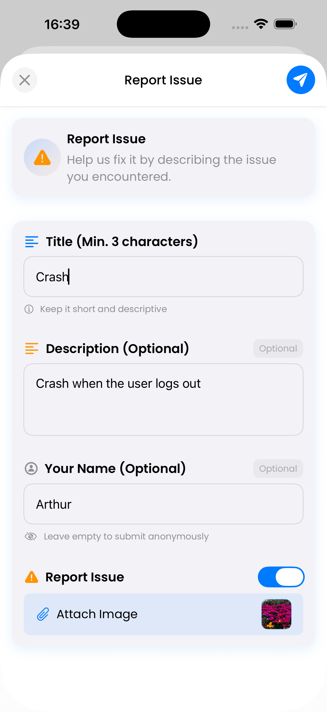
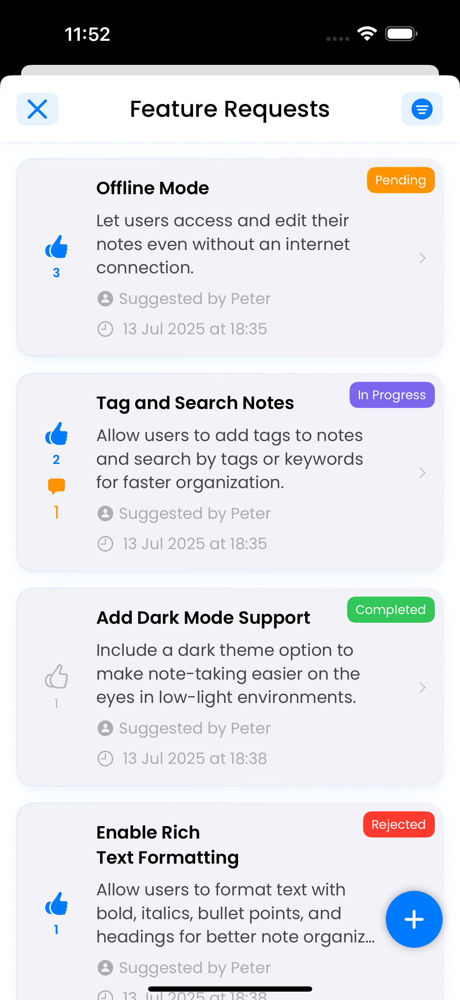

# Votice SDK

|  | 🗳️ A lightweight native Swift SDK to collect suggestions, feedback and votes directly within your iOS, iPadOS, macOS and tvOS app. |
|:---:|:---|

[](https://swift.org/)
[](#)
[](https://swift.org/package-manager/)
[](LICENSE)

Votice is a native Swift SDK that allows you to integrate user feedback, suggestion boards, issues, and voting mechanisms in your app with a clean UI and a simple setup. It connects to a custom backend using HMAC authentication and does not require Firebase or other configurations.

<p align="leading">
  
  
  
  
  
</p>

## 📱 Management App

The Votice management app for handling suggestions or issues and apps is available for download on the App Store:

[](https://apps.apple.com/us/app/id6673904950)

**Available for:** iOS, iPadOS and macOS

---

## ✅ Requirements

- iOS 17+ / iPadOS 17+ / macOS 14+ / tvOS 17+
- Swift 5.9+
- SwiftUI-based project
- Votice backend properly configured (API key + secret)

> ⚠️ Support for tvOS will be available in future releases.

## 🛠 Installation

Add this line to your `Package.swift` dependencies:

```swift
.package(url: "https://github.com/artcc/votice-sdk", from: "1.0.11"),
```

Or via Xcode:

1. Open your project.
2. Go to **File > Add Packages...**
3. Enter the URL of the Votice repo: https://github.com/artcc/votice-sdk
4. Choose the latest version.

## 📦 Package Info

```swift
// swift-tools-version:5.9
let package = Package(
    name: "Votice",
    platforms: [
        .iOS(.v17),
        .macOS(.v14),
        .tvOS(.v17)
    ],
    products: [
        .library(
            name: "VoticeSDK",
            targets: ["VoticeSDK"]
        )
    ],
    targets: [
        .target(
            name: "VoticeSDK",
            path: "Sources/Votice"
        ),
        .testTarget(
            name: "VoticeTests",
            dependencies: ["VoticeSDK"],
            path: "Tests/VoticeTests"
        )
    ]
)
```

## 🚀 Getting Started

### 1. Configure the SDK (Mandatory)

Before using any Votice component, configure it with your app credentials:

```swift
import VoticeSDK

try Votice.configure(
    apiKey: "your-api-key",
    apiSecret: "your-api-secret",
    appId: "your-app-id"
)
```

You can reset or check configuration status:

```swift
Votice.reset()

let configured = Votice.isConfigured
```

### 2. Show the Feedback UI (Mandatory) with basic configuration

You can embed the main interface as a SwiftUI view:

```swift
Votice.feedbackView()
```

Or present it as a modal sheet:

```swift
Votice.feedbackSheet(isPresented: $isShowingFeedback)
```

Or use a NavigationLink:

```swift
NavigationLink {
  Votice.feedbackNavigationView())
} label: {
  Text("Navigate to Feedback")
}
```

### 3. Customize Appearance (Optional)

Use the default system-adaptive theme:

```swift
let theme = Votice.systemTheme()
```

Or create your own theme:

```swift
let theme = Votice.createTheme(
    primaryColor: .blue,
    backgroundColor: .white,
    surfaceColor: .gray.opacity(0.1)
)
```

Advanced configuration is also available:

```swift
let customTheme = Votice.createAdvancedTheme(
    primaryColor: .purple,
    accentColor: .pink,
    backgroundColor: Color(.systemBackground),
    surfaceColor: Color(.secondarySystemBackground),
    destructiveColor: .red,
    successColor: .mint,
    warningColor: .orange)    
```

Then pass it into the view:

```swift
Votice.feedbackView(theme: theme)
```

### 4. Localize Texts (Optional)

You can provide custom localized texts by conforming to `VoticeTextsProtocol`:

```swift
Votice.setTexts(VoticeTexts())
```

Example:

```swift
struct VoticeTexts: VoticeTextsProtocol {
    let cancel = String(localized: "Cancel")
    let error = String(localized: "Error")
    let ok = String(localized: "Ok")
    let submit = String(localized: "Submit")
    let optional = String(localized: "Optional")
    let success = String(localized: "Success")
    let warning = String(localized: "Warning")
    let info = String(localized: "Information")
    let genericError = String(localized: "Something went wrong. Please try again.")
    let anonymous = String(localized: "Anonymous")
    let loadingSuggestions = String(localized: "Loading suggestions...")
    let noSuggestionsYet = String(localized: "No suggestions yet.")
    let beFirstToSuggest = String(localized: "Be the first to suggest something!")...
}
```

To reset to the default English:

```swift
Votice.resetTextsToDefault()
```

Check this URL to learn how to localize your app https://gist.github.com/ArtCC/10a0eff42f1f62c305b28c15883b9b9f

### 5. Using Custom Fonts (Optional)

You can customize all SDK interface fonts using your own fonts included in your project. This allows you to maintain visual consistency with your app's identity.

#### 1. Add your fonts to the project

1. Drag the font files (.ttf, .otf) into your Xcode project.
2. Make sure to add them in the "Copy Bundle Resources" section of your target.
3. Add the font names in the `Fonts provided by application` field in your Info.plist.

#### 2. Configure fonts in Votice

Create a font configuration and apply it to the SDK before displaying any Votice view:

```swift
let poppinsConfig = VoticeFontConfiguration(
    fontFamily: "Poppins",
    weights: [
        .regular: "Poppins-Regular",
        .medium: "Poppins-Medium",
        .semiBold: "Poppins-SemiBold",
        .bold: "Poppins-Bold"
    ]
)
Votice.setFonts(poppinsConfig)
```

- `fontFamily`: Name of the font family (must match the name registered in the system).
- `weights`: Dictionary with the exact names of each font weight variant.

#### 3. Reset to the system font

If you want to revert to the default iOS font:

```swift
Votice.resetFontsToSystem()
```

#### 4. Themes with custom fonts

You can create a theme that respects the custom font:

```swift
let theme = Votice.createThemeWithCurrentFonts(primaryColor: .blue)
```

Or use the system theme with the custom font:

```swift
let theme = Votice.systemThemeWithCurrentFonts()
```

Then pass it to the feedback view:

```swift
Votice.feedbackView(theme: theme)
```

> ℹ️ If you do not configure custom fonts, the SDK will use the default system fonts.

### 6. Comment on suggestions (Optional)

You can allow users to comment on suggestions by enabling the comments feature (Default is enabled):

```swift
Votice.setCommentIsEnabled(enabled: Bool)
```

### 7. User is premium (Optional)

If you want to mark the current user as a premium user (Default is false), you can do so with:

```swift
Votice.setUserIsPremium(isPremium: Bool)
```

### 8. Debug Logging (Optional)

By default, Votice SDK runs silently to avoid cluttering your development console. If you need to troubleshoot SDK issues or see internal operations, you can enable debug logging (Default is disabled):

Enable debug logging (useful for troubleshooting):
```swift
Votice.setDebugLogging(enabled: true)
```

Check current logging status:
```swift
let isLoggingEnabled = Votice.isDebugLoggingEnabled
```

Disable when no longer needed:
```swift
Votice.setDebugLogging(enabled: false)
```

**When to use debug logging:**
- Troubleshooting network requests to your backend
- Verifying SDK configuration
- Understanding internal SDK behavior
- During development/testing phases

**Note:** Debug logging is automatically disabled in production builds and should only be enabled when specifically needed for debugging purposes.

### 8. Show completed suggestions in a separate tab (Optional)

You can choose to display suggestions with status `completed` in their own tab. When enabled:

- A segmented control appears with two tabs: "Active" and "Completed".
- Completed suggestions are removed from the main list.
- The "Completed" filter disappears from the filter menu (no longer needed).
- Completed suggestions are only visible in the dedicated tab.
- If you don't enable it, the behavior remains the same as before.

Enable:
```swift
Votice.setShowCompletedSeparately(enabled: true)
```
Disable (returns to original behavior):
```swift
Votice.setShowCompletedSeparately(enabled: false)
```

### 9. Configure visible suggestion statuses (Optional)

By default, all optional statuses (`accepted`, `blocked`, `rejected`) are visible along with the mandatory ones. You can choose which optional statuses to show in both the list and the filter menu.

Mandatory statuses (always shown):
- `completed` (or in its separate tab if you enabled section 8)
- `in-progress`
- `pending`

Optional statuses (individually hideable):
- `accepted`
- `blocked`
- `rejected`

Configure which optional statuses are visible:
```swift
// Example: show accepted & rejected, hide blocked
Votice.setVisibleOptionalStatuses(accepted: true, blocked: false, rejected: true)
```

Behavior:
- Hidden optional statuses are removed from the filter menu and never displayed in the list.
- If a previously selected (persisted) filter becomes hidden, it is automatically cleared.
- Works together with the "completed separately" mode (section 8). If that mode is active, `completed` will still not appear in filters, regardless of this configuration.
- Defaults: all three optional statuses visible (equivalent to `true, true, true`).

Use cases:
- Simplify the board for early product phases (e.g. only pending + in-progress + completed)
- Gradually introduce refinement states later (enable accepted / blocked / rejected)

> Note: Calling this method multiple times replaces the previous configuration entirely.

---

## 👨🏻‍💻 Contributing to Votice SDK

Thank you for your interest in contributing to **Votice**!  
This guide will help you submit issues, propose changes, and open pull requests in a way that fits the project.

## 🐞 Reporting Bugs

If you find a bug:

- Search [issues](https://github.com/artcc/votice-sdk/issues) first — it may already be reported.
- Open a new issue with:
  - A clear title
  - Steps to reproduce
  - Expected and actual behavior
  - SDK version and platform

## 🚀 Feature Requests

We welcome feedback!

- If it's a major change, open an issue first to discuss.
- Make sure it aligns with the lightweight philosophy of the SDK.

## 👤 Author

Arturo Carretero Calvo

[@artcc](https://github.com/artcc)

## License

Votice SDK is available under the MIT license. See the [LICENSE](LICENSE) file for more info.

---

**Arturo Carretero Calvo - 2025**
